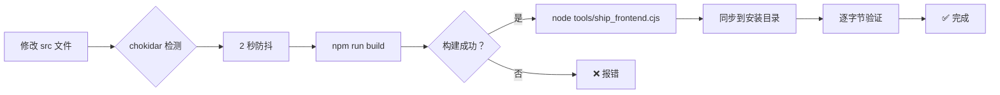

# 前端自动构建监听工具使用指南

## 问题背景

当你修改前端代码时，桌面上的应用不会自动重新构建并生效。这是因为：

1. **安装版**读取的是 `%LOCALAPPDATA%\Programs\voice-morph-desktop\resources\backend\web_dist`，而不是源码目录 `D:\变声\web\dist`
2. 后端启动时的 `backend_autosync.py` 只会在启动时同步一次前端代码
3. 手动每次都要执行 `npm run ship` 很麻烦

## 解决方案

使用新创建的 `watch-and-ship.cjs` 工具，它可以：
- 👀 监听 `web/src/` 目录的文件变化
- ⚙️ 自动执行 `npm run build` 构建
- 📦 构建成功后自动同步到已安装的桌面端
- ✅ 逐字节验证同步结果

## 使用方法

### 方式一：完整监听模式（推荐）

```bash
cd web
npm run watch-ship
```

**效果：**
- 修改任何 `.tsx` / `.ts` / `.css` 文件后等待 2 秒
- 自动构建
- 自动同步到安装版
- 提示"已同步到安装版，请完全退出应用再打开以查看更新"

**注意：** 需要确保应用已安装（不是源码开发模式）

### 方式二：仅构建模式（开发调试）

```bash
cd web
npm run watch-ship -- --dev
```

**效果：**
- 只构建到 `web/dist/`，不同步到安装版
- 适合快速测试构建是否成功

## 工作原理



## 依赖项

工具使用了 `chokidar` 库进行文件监听，已添加到 `devDependencies`：

```json
{
  "devDependencies": {
    "chokidar": "^3.6.0"
  }
}
```

如果缺少依赖，运行：
```bash
cd web
npm install chokidar --save-dev
```

## 注意事项

### ⚠️ 重要提醒

1. **完全退出应用**：同步完成后，必须完全退出桌面应用（包括桌宠进程），然后重新打开才能看到新界面
   - 仅仅关闭窗口不够，桌宠会常驻后台
   - 检查任务栏托盘图标，右键退出

2. **文件占用问题**：如果应用正在运行，可能导致部分文件无法写入
   - 遇到写入失败时，先退出应用再运行同步

3. **监听范围**：只监听 `web/src/` 目录，不包括 `web/electron/`（主进程代码）
   - 修改主进程代码仍需重打包 asar

4. **防抖机制**：2 秒防抖避免频繁构建
   - 连续修改时会等待最后一次修改后 2 秒才开始构建

## 常见问题

### Q: 为什么我的修改没有触发构建？
A: 检查以下几点：
- 是否修改了 `web/src/` 下的文件？
- 监听器是否正在运行？（终端应有实时日志）
- 文件扩展名是否在监听范围内？

### Q: 构建失败了怎么办？
A: 查看终端输出的错误信息，通常是：
- TypeScript 类型错误
- Vite 配置问题
- 缺少依赖包

### Q: 同步后应用还是旧版本？
A: 确认以下事项：
- 是否完全退出了应用（包括桌宠）？
- 是否安装了桌面版应用？（源码模式不需要此步骤）
- 尝试手动运行 `npm run ship` 验证

### Q: 可以只监听到 dist 目录吗？
A: 不建议。应该监听源码目录 `src/`，在构建前同步能减少等待时间。

## 与现有工具的对比

| 工具 | 用途 | 触发方式 | 同步目标 |
|------|------|----------|----------|
| `npm run ship` | 手动构建 + 同步 | 手动执行 | 安装版 |
| `npm run watch-ship` | 自动构建 + 同步 | 文件变化 | 安装版 |
| `tools/sync_backend.ps1` | 后端代码同步 | 手动执行 | staging 目录 |
| `m2_server/backend_autosync.py` | 后端自动同步 | 后端启动时 | staging 目录 |

## 未来改进方向

可以考虑添加的功能：
- [ ] 支持热重载（HMR）到桌面端
- [ ] 增量构建优化
- [ ] 构建失败时回滚到上一个稳定版本
- [ ] 支持监听更多文件类型（如静态资源）
